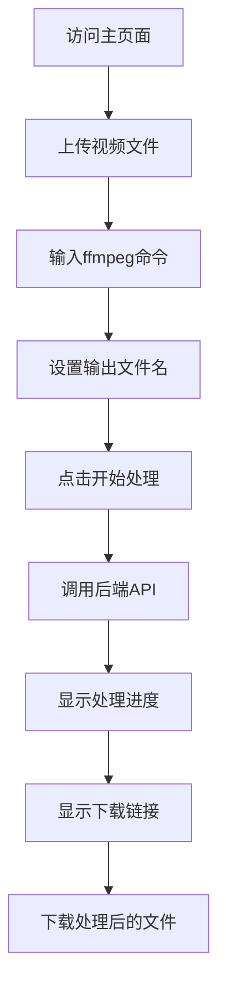

## 1. 产品概述
一个简单的前端页面，允许用户上传视频文件、输入ffmpeg命令和输出文件名，通过调用后端API进行视频处理，并提供处理后的文件下载功能。

## 2. 核心功能

### 2.1 用户角色
| 角色 | 注册方式 | 核心权限 |
|------|----------|----------|
| 普通用户 | 无需注册 | 上传视频、输入ffmpeg命令、下载处理后的文件 |

### 2.2 功能模块
我们的视频处理工具包含以下主要页面：
1. **主页面**: 文件上传、ffmpeg命令输入、输出文件名设置、处理结果显示、下载功能。

### 2.3 页面详情
| 页面名称 | 模块名称 | 功能描述 |
|-----------|-------------|-------------|
| 主页面 | 文件上传区域 | 拖拽或点击上传视频文件，显示上传进度和文件名 |
| 主页面 | ffmpeg命令输入 | 文本框输入ffmpeg命令，提供常用命令示例 |
| 主页面 | 输出文件名设置 | 输入框设置输出文件名，默认自动生成 |
| 主页面 | 处理控制 | 开始处理按钮，显示处理状态 |
| 主页面 | 结果显示 | 显示处理成功后的下载链接 |
| 主页面 | 下载功能 | 提供下载按钮，点击后直接下载处理后的文件 |

## 3. 核心流程
用户操作流程：
1. 用户访问主页面
2. 上传视频文件（支持拖拽和点击选择）
3. 输入ffmpeg命令
4. 设置输出文件名（可选）
5. 点击开始处理按钮
6. 系统调用后端API（http://127.0.0.1:5000/upload）
7. 显示处理进度
8. 处理完成后显示下载链接
9. 用户点击下载按钮获取处理后的文件

## 4. 用户界面设计

### 4.1 设计风格
- **主色调**: 蓝色（#007bff）和白色
- **按钮样式**: 圆角矩形，悬停效果
- **字体**: 系统默认字体，主要文字14-16px
- **布局风格**: 卡片式布局，居中显示
- **图标风格**: 简洁的线性图标

### 4.2 页面设计概述
| 页面名称 | 模块名称 | UI元素 |
|-----------|-------------|-------------|
| 主页面 | 文件上传区域 | 虚线边框的拖拽区域，包含上传图标和文字提示，支持拖拽和点击 |
| 主页面 | ffmpeg命令输入 | 多行文本框，带语法高亮，提供常用命令下拉选择 |
| 主页面 | 输出文件名设置 | 单行文本框，默认显示基于输入文件的生成名称 |
| 主页面 | 处理控制 | 大型开始按钮，处理时显示加载动画和进度条 |
| 主页面 | 结果显示 | 成功时显示绿色提示和下载链接，失败时显示错误信息 |
| 主页面 | 下载功能 | 蓝色下载按钮，点击后触发文件下载 |

### 4.3 响应式设计
- 桌面端优先设计
- 移动端自适应，主要功能在手机上也能正常使用
- 触摸交互优化，按钮大小适合手指点击