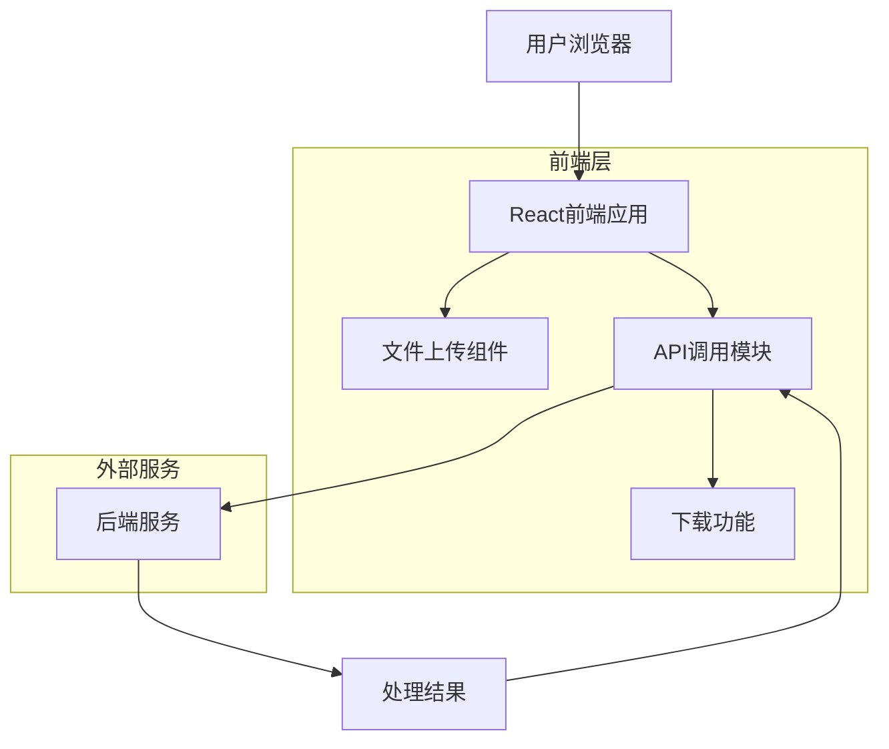
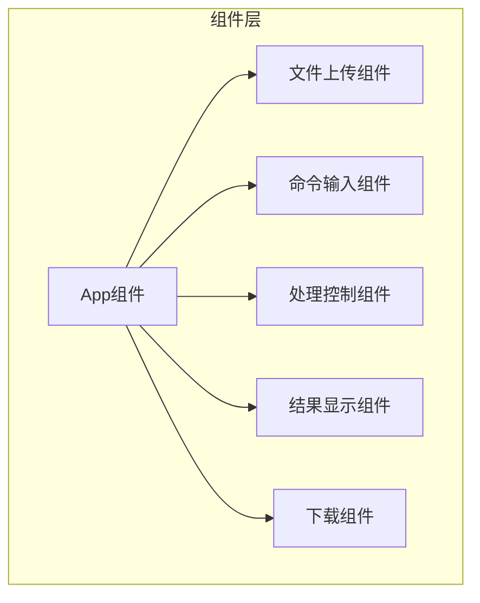

## 1. 架构设计



## 2. 技术描述
- 前端: React@18 + tailwindcss@3 + vite
- 初始化工具: vite-init
- 后端: 无（直接调用现有后端服务）

## 3. 路由定义
| 路由 | 用途 |
|-------|---------|
| / | 主页面，包含所有视频处理功能 |

## 4. API定义

### 4.1 核心API

文件上传和处理
```
POST http://127.0.0.1:5000/upload
```

请求参数（FormData格式）:
| 参数名称 | 参数类型 | 是否必需 | 描述 |
|-----------|-------------|-------------|-------------|
| file | File | 是 | 要处理的视频文件 |
| command | string | 是 | ffmpeg命令 |
| output_filename | string | 否 | 输出文件名 |

响应参数:
| 参数名称 | 参数类型 | 描述 |
|-----------|-------------|-------------|
| status | string | 处理状态（success/error） |
| download_url | string | 处理后的文件下载链接 |
| message | string | 状态信息或错误描述 |

示例响应:
```json
{
  "status": "success",
  "download_url": "http://127.0.0.1:5000/download/processed_video.mp4",
  "message": "处理完成"
}
```

## 5. 前端组件架构



## 6. 状态管理

### 6.1 组件状态
使用React useState管理以下状态：
- file: 上传的文件对象
- command: ffmpeg命令字符串
- outputFilename: 输出文件名
- isProcessing: 处理中状态
- progress: 处理进度
- result: 处理结果（包含download_url）
- error: 错误信息

### 6.2 文件处理流程
1. 用户选择文件后，验证文件类型和大小
2. 输入ffmpeg命令和输出文件名
3. 点击处理按钮后，构建FormData对象
4. 使用fetch API发送POST请求到后端
5. 监听上传进度（可选）
6. 接收响应后更新UI状态
7. 提供下载功能